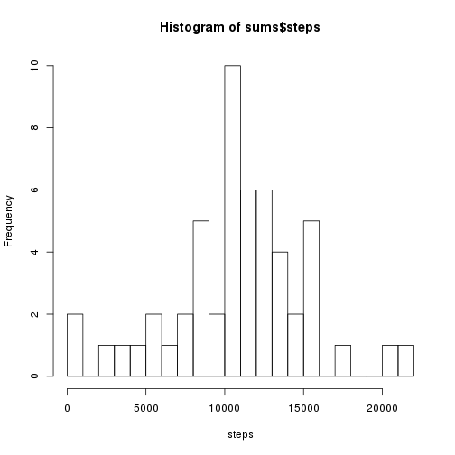
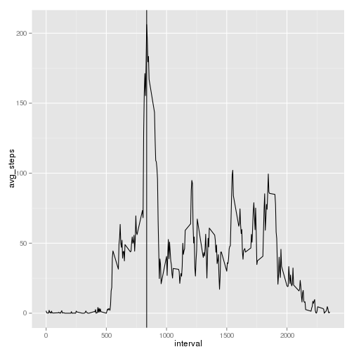
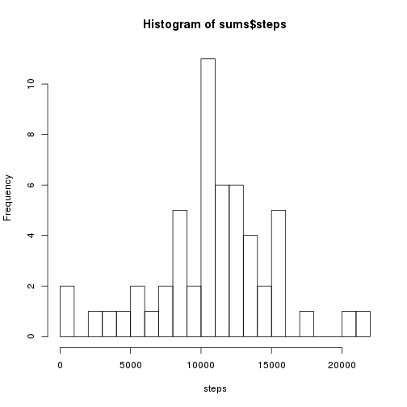
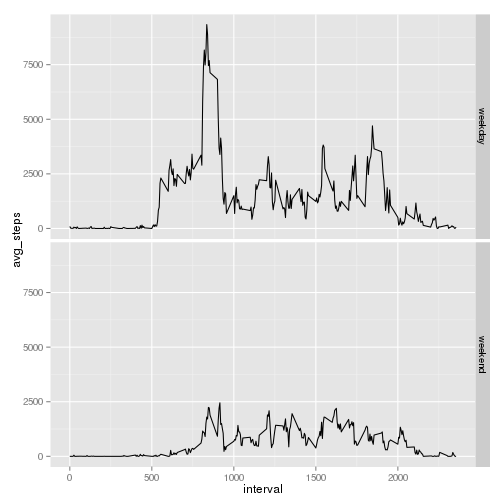

## Loading and preprocessing the data

Read the data and parse the dates:

```r
library(data.table)
data <- data.table(read.csv(file='activity.csv', header=TRUE))
data[, date:= as.IDate(date)]
```

## What is mean total number of steps taken per day?


```r
sums <- aggregate(steps ~ date, data, sum)
hist(sums$steps, breaks=25, xlab='steps')
```

 

```r
mean(sums$steps, na.rm=TRUE)
```

[1] 10766.19

```r
median(sums$steps, na.rm=TRUE)
```

[1] 10765

## What is the average daily activity pattern?


```r
library(ggplot2)
pattern <- data[, mean(steps, na.rm=TRUE), by=interval]
setnames(pattern, c("interval", "avg_steps"))
xmax <- pattern$interval[[which.max(pattern$avg_steps)]]
qplot(interval, avg_steps, data=pattern, geom="line") + geom_vline(xintercept=xmax)
```

 

```r
xmax
```

[1] 835

## Imputing missing values

Total number of missing values:

```r
sum(is.na(data$steps))
```

[1] 2304

We have the means for intervals in the 'pattern' variable. Replace the NA's with the interval means:


```r
clean_data <- data
clean_data$steps[is.na(data$steps)] <- pattern$avg_steps[is.na(data$steps)]
sums <- aggregate(steps ~ date, clean_data, sum)
hist(sums$steps, breaks=25, xlab='steps')
```

 

```r
mean(sums$steps, na.rm=FALSE)
```

[1] 10766.19

```r
median(sums$steps, na.rm=FALSE)
```

[1] 10765.59

Imputting the missing values caused a negligible change in the total median of steps.

## Are there differences in activity patterns between weekdays and weekends?


```r
clean_data[, day:= factor(wday(date) %in% c(1,7), labels=c("weekday", "weekend"))]
pattern <- aggregate(steps ~ day + interval, clean_data, sum)
setnames(pattern, c("day", "interval", "avg_steps"))
qplot(interval, avg_steps, data=pattern, facets=day~., geom="line")
```

 

The plot shows that the average numbers of steps on non-working days are generally lower than on working days.
